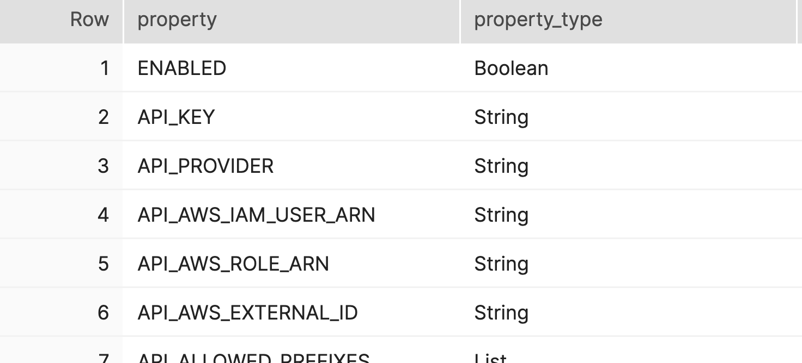
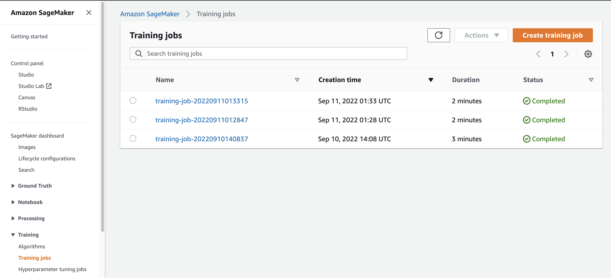
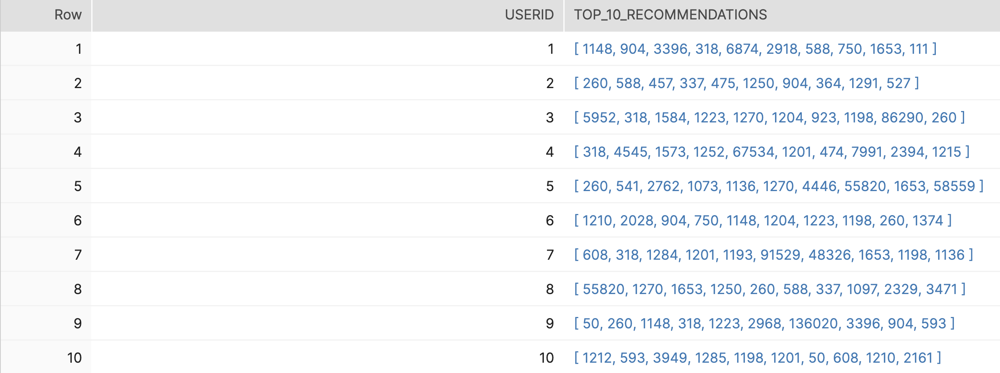

# Recommendation Engine Service with
[Build a Recommendation Engine with AWS SageMaker](https://quickstarts.snowflake.com/guide/recommendation_engine_aws_sagemaker/index.html?index=..%2F..index#0)에 따라 `Snowflake`, `SageMaker`를 사용하여 간단한 영화 추천 시스템을 구현 


## Steps
1. Snowflake에 샘플 데이터 로드 - `snowflake-setup.sql` 
2. 로컬 테스트를 위해 테스트 테이블 생성 - `snowflake-setup.sql` 
3. Snowflake, AWS credentials 설정
    ```python
    # snowflake-sagemaker-recommendation/sfguide-recommender-pipeline/sagemaker/container/recommendation_engine/train
    SF_ACCOUNT = '<my_snowflake_account>'
    SF_WH = '<my_snowflake_warehouse_name>'
    SF_USER = '<my_snowflake_username>'
    ```
    ```bash
    # snowflake password는 AWS SSM에 저장
    # region = us-east-1
    aws ssm put-parameter \
        --name "snf_password" \
        --type "String" \
        --value "<my_snowflake_password>" \
    ```
4. `snowflake-sagemaker-recommendation/sfguide-recommender-pipeline/sagemaker/container`에서 도커 이미지 빌드  
    ```
    docker build -t snf-recommender-lab:latest .
    ```
5. `snowflake-sagemaker-recommendation/sfguide-recommender-pipeline/sagemaker/container/local_test`에서 테스트
    ```console
    $ ./train_local.sh snf-recommender-lab:latest
    rm: test_dir/model/*: No such file or directory
    Starting the training.
    Evaluating RMSE, MAE of algorithm SVD on 5 split(s).

                    Fold 1  Fold 2  Fold 3  Fold 4  Fold 5  Mean    Std     
    RMSE (testset)    1.1074  1.0852  1.1445  1.1289  1.0695  1.1071  0.0275  
    MAE (testset)     0.8961  0.8998  0.9258  0.9025  0.8784  0.9005  0.0152  
    Fit time          0.05    0.03    0.04    0.04    0.03    0.04    0.01    
    Test time         0.00    0.00    0.00    0.00    0.00    0.00    0.00    
    Top 10 predictions for all users saved to Snowflake table named:  USER_MOVIE_RECOMMENDATIONS_LOCAL_TEST
    Training complete.
    $ ./serve_local.sh snf-recommender-lab:latest
    $ ./predict.sh payload.csv
    *   Trying ::1:8080...
    * Connected to localhost (::1) port 8080 (#0)
    > POST /invocations HTTP/1.1
    > Host: localhost:8080
    > User-Agent: curl/7.77.0
    > Accept: */*
    > Content-Type: text/csv
    > Content-Length: 25
    > 
    * Mark bundle as not supporting multiuse
    < HTTP/1.1 200 OK
    < Server: nginx/1.18.0
    < Date: Sat, 10 Sep 2022 11:39:11 GMT
    < Content-Type: text/csv; charset=utf-8
    < Content-Length: 73
    < Connection: keep-alive
    < 
    4.311368899637783
    4.311368899637783
    4.019752920763314
    3.9924950123262444
    * Connection #0 to host localhost left intact
    ```

6. ECR에 도커 이미지 업로드
    ```
    ./build_and_push.sh snf-recommender-lab
    ```
7. SageMaker 실행을 위한 role 생성
    - Role1(name: `SageMakerTest`) : AWS IAM에서 `AmazonSageMakerFullAccess`, `AmazonSSMReadOnlyAccess`를 포함하는 role을 생성한다.
    - Role2(name: `SnowflakeAPIGatewayTest`) : Snowflake가 assume하여 API Gateway를 실행할 role을 생성한다. "Trusted entity type"을 "AWS account"로 하여 "Another AWS account"에 본인의 AWS Account ID를 입력한다.
8. Snowflake External Functions에 IAM role을 설정한다.
    ```yml
    # snowflake-sagemaker-recommendation/sfguide-recommender-pipeline/sls/config.dev.yml
    unique_id: <name>
    region: us-east-1
    sagemaker_role_arn: arn:aws:iam::<account>:role/SageMakerTest
    training_image_ecr_path: <account>.dkr.ecr.us-east-1.amazonaws.com/snf-recommender-lab
    snf_ef_role_arn: arn:aws:iam::<account>:role/SnowflakeAPIGatewayTest
    snf_ef_role_principal: arn:aws:sts::<account>:assumed-role/SnowflakeAPIGatewayTest/snowflake
    ```
    `snowflake-sagemaker-recommendation/sfguide-recommender-pipeline/sls`에서 AWS Lambda와 API Gateway로 서버리스 앱을 배포한다.
    ```console
    $ sls deploy
    Service Information
    service: snf-demo-yjdevtestrocket
    stage: dev
    region: us-east-1
    stack: snf-demo-yjdevtestrocket-dev
    resources: 24
    api keys:
    None
    endpoints:
    POST - https://xxxxxxxxxxx.execute-api.us-east-1.amazonaws.com/dev/train
    POST - https://xxxxxxxxxxx.execute-api.us-east-1.amazonaws.com/dev/deploy
    POST - https://xxxxxxxxxxx.execute-api.us-east-1.amazonaws.com/dev/invoke
    functions:
    train_and_generate_recommendations: snf-demo-yjdevtestrocket-dev-train_and_generate_recommendations
    deploy_model: snf-demo-yjdevtestrocket-dev-deploy_model
    invoke_model: snf-demo-yjdevtestrocket-dev-invoke_model
    layers:
    None
    ```
9. API Gateway를 Snowflake와 연결한다.  
    - 먼저 Snowflake에 api integration을 생성한다. - `snowflake-setup.sql`  
    - `api integration`을 생성한 후 `describe integration snf_recommender_api_integration`을 실행하여 정보를 확인한다. 
        
    - 값을 확인하여 아래 JSON 내용을 채운 후, Role `SnowflakeAPIGatewayTest`의 "Trust relationships"에 대체한다.
        ```json
        {
            "Version": "2012-10-17",
            "Statement": [
                {
                "Effect": "Allow",
                "Principal": {
                    "AWS": "<API_AWS_IAM_USER_ARN>"
                },
                "Action": "sts:AssumeRole",
                "Condition": {"StringEquals": { "sts:ExternalId": "<API_AWS_EXTERNAL_ID>" }}
                }
            ]
        }
        ```
10. Snowflake에 External functions을 생성한다. - `snowflake-setup.sql`
11. External functions 테스트를 위한 테이블을 생성한다. - `snowflake-setup.sql`

## Results
우선 생성한 training 데이터 테이블을 input으로, 결과값을 저장할 테이블을 output으로 하여 `train_and_get_recommendations` 함수를 실행한다.
```sql
use role sysadmin;
select train_and_get_recommendations('TEST.PUBLIC.ratings_train_data','TEST.PUBLIC.user_movie_recommendations');
/*
TRAIN_AND_GET_RECOMMENDATIONS('TEST.PUBLIC.RATINGS_TRAIN_DATA','TEST.PUBLIC.USER_MOVIE_RECOMMENDATIONS')
---------------------------------------------------------------------------------------------------------
arn:aws:sagemaker:us-east-1:123456789012:training-job/training-job-20220911013315
*/
```
SageMaker에서 확인하면 training job이 생성되었다.


실행 결과인 예측값이 `user_movie_recommendations` 테이블에 저장되었다.   
```sql
select * from user_movie_recommendations limit 10;
```
